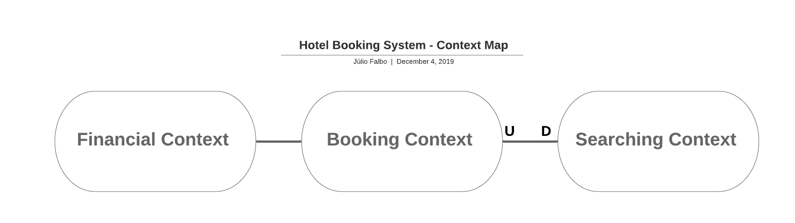
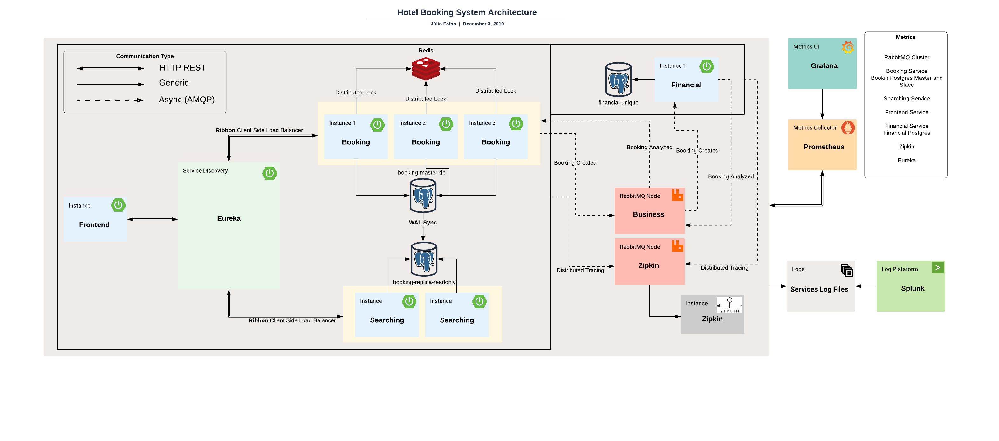

## What are Microservices?

There are thousands of definitions out there about what are microservices, but the one I like best is that of the great master Martin Fowler

> In short, the microservice architectural style is an approach to developing a single application as a suite of small services, each running in its own process and communicating with lightweight mechanisms, often an HTTP resource API. These services are built around business capabilities and independently deployable by fully automated deployment machinery. There is a bare minimum of centralized management of these services, which may be written in different programming languages and use different data storage technologies.
    
>**James Lewis and Martin Fowler**

# What is this?
This is a whole environment of a Microservices Architecture. Here you can find the implementation of a lot of "fancy" patterns that we can find like **CQRS**, **Distributed Lock**, **Domain Events**, etc.

## Bounded Context

## Architecture Diagram

## Getting Started

### Start
- Clone the repository
  - `git clone git@github.com:juliofalbo/complete-microservices-env.git`
- Build the services
  - `./build.sh`
  - Tip: Run this command and go to take a coffee... or 2...
- Start the whole environment
  - `./start.sh`
  
_Note: If you want to build and run just call `./start.sh true`_

### Stop
- Stop all services keeping the volumes (preserving data)
  - `./stop.sh` 
- Stop all services **removing all volumes** (it means that you will remove all data)
  - `./stop.sh true`

## Stack
- **RabbitMQ** as a Message Broker
- **Feign** to create REST Clients
- **Ribbon** to Client Side Load Balance
- **Eureka** to a Service Discovery
- **Sleuth** and **Zipkin** to a Distributed Tracing
- **Hystrix** to a Fault Tolerance
- **Prometheus** as a Metrics Collector
- **Grafana** as Metrics Analytics and UI
- **Postgres** as Database
- **Flyway** as Database Migration Tool
- **Splunk** as Log Analysis Platform
- **Redis** to handle Distributed Lock
- **Swagger** to create an OpenAPI documentation

## Ports

|     Application       |     Port          |
| ------------- | ------------- |
| Booking Microservice | 8100, 8101, 8102  |
| Searching Microservice | 8200, 8201 |
| Financial Microservice | 8300 |
| Frontend Microservice | 8400 |
| RabbitMQ | 5672, 5673 |
| RabbitMQ Admin UI | 15672, 15673 |
| Booking Postgres Master | 5432 |
| Booking Postgres ReadOnly Replica| 5433 |
| Financial Postgres | 5434 |
| Grafana | 3000 |
| Prometheus | 9090 |
| Splunk | 8000 |
| Netflix Eureka | 8761 |
| Zipkin | 9411 |

## Distributed Lock Test
In the root folder we have a file called `CreateBookingConcurrencyTest.jmx`. So, this is a [JMeter](https://jmeter.apache.org/) that can be easily imported and the only thing that you should do is change the `room id` for the tests.
With this test it is possible to see that the booking service is queuing the requests based on the distributed lock on Redis and treating the concurrency issue.  

# Links
- Grafana Dashboards
  - http://localhost:3000/dashboards
- All monitored services
  - http://localhost:9090/targets
- Splunk
  - http://localhost:8000
- RabbitMQ UI
  - http://localhost:15672
  - http://localhost:15673
- Zipkin
  - http://localhost:9411
- Eureka
  - http://localhost:8761
- Booking Swagger
  - http://localhost:8100/swagger-ui.html
  - http://localhost:8101/swagger-ui.html
  - http://localhost:8102/swagger-ui.html
- Searching Swagger
  - http://localhost:8200/swagger-ui.html
  - http://localhost:8201/swagger-ui.html
- Frontend
  - http://localhost:8400
 
## TODO List

- [x] [DDD Study](https://medium.com/tradeshift-engineering/my-vision-as-a-software-engineer-about-ddd-domain-driven-design-2f36ec18a1ec)
- [x] Create [RabbitMQ Cluster](https://www.rabbitmq.com/clustering.html)
- [x] Create [https://grafana.com/](Grafana) and [Prometheus](https://prometheus.io/)
- [x] Create Postgres Replication Strategy
- [x] Create a Service Discovery ([Eureka](https://www.baeldung.com/spring-cloud-netflix-eureka))
- [x] Create Booking Service
- [x] Create Searching Service
- [x] Create [Distributed Lock with Redis](https://redis.io/topics/distlock)
- [x] Create [Domain Events](https://medium.com/tradeshift-engineering/my-vision-as-a-software-engineer-about-ddd-domain-driven-design-part-2-973bcf5a9848)
- [x] Create [Retry Strategy and DLQ Strategy](https://github.com/Tradeshift/spring-rabbitmq-tuning/wiki/Queues-Strategy) for RabbitMQ messages
- [x] Create Financial Service
- [x] Creating Frontend
- [x] Creating Retry Strategy for HTTP requests ([Feign](https://spring.io/projects/spring-cloud-openfeign))
- [x] Create Distributed Tracing with [Zipkin](https://zipkin.io/)
- [x] Create and Integrate [Splunk](https://www.splunk.com/) with all Services
- [x] Integrate Prometheus with: RabbitMQ Cluster, All Postgres containers, All Services containers, Zipkin
- [x] Create a [docker-compose](https://docs.docker.com/compose/) to up the whole environment
- [x] Add [embedded RabbitMQ and embedded Redis](https://github.com/testcontainers/testcontainers-spring-boot) for test purpose
- [x] Create Dashboards on Grafana for all services in Prometheus
- [x] Create a Continues Integration with [TravisCI](https://travis-ci.org/)
- [ ] Create more Unit tests to cover more classes and scenarios
- [ ] Implement [Twitter Diffy](https://github.com/twitter/diffy) to test changes
- [ ] Implement Integration Test with [Karate (Cucumber)](https://github.com/intuit/karate)
- [ ] Create Auth service with [Keycloack](https://www.keycloak.org/)
- [ ] Create business metrics on the Services
- [ ] Change docker-compose to Kubernetes using [Kops](https://github.com/kubernetes/kops)

## References

- [Microservices Resource Guide - Martin Fowler](https://martinfowler.com/microservices/)
- [Frontend Template - Delux by Colorlib](https://colorlib.com/wp/template/deluxe/)
- [Distributed Lock](https://redis.io/topics/distlock)
- [Spring Distributed Lock Lib](https://github.com/alturkovic/distributed-lock)